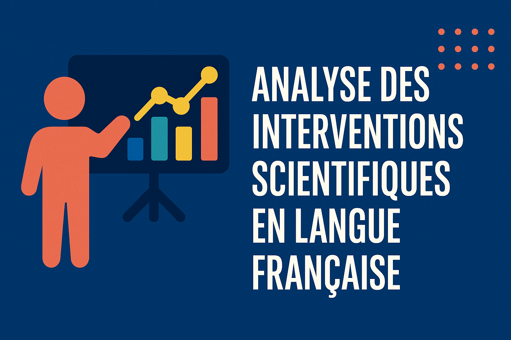

# 🎤 Analyse des interventions scientifiques en langue française

## 👤 Réalisé par
**Nom** : Hicham Errihani  
**Email** : hichamerrihani.pro@gmail.com  
**Téléphone** : +212 667 407029 / +212 616 154196

## 🎯 Objectif
Estimer le nombre d’interventions scientifiques (communications, présentations) réalisées en langue française par des chercheurs, en utilisant l’API de HAL.

## 📁 Contenu
- Script Python (via Jupyter Notebook)
- Résultat CSV
- Rapport technique
